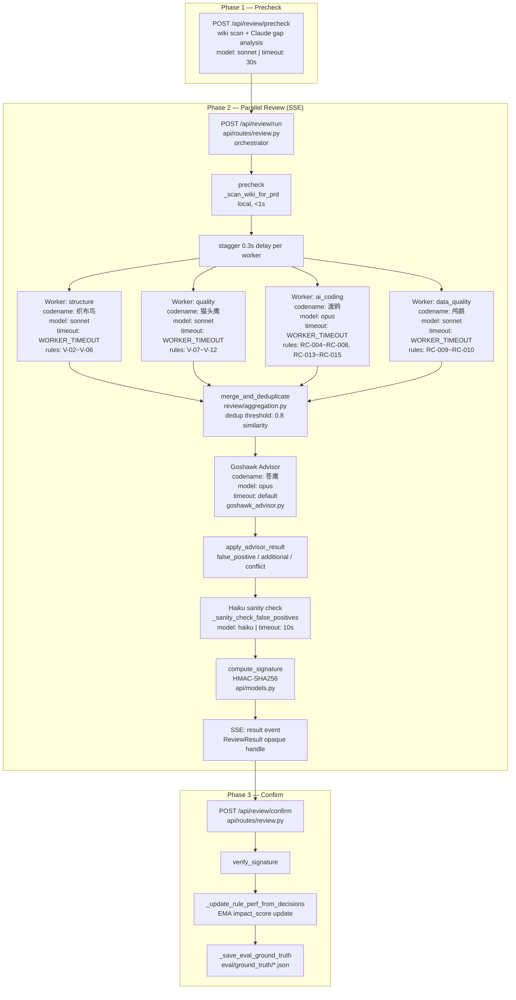
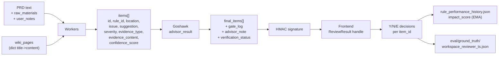
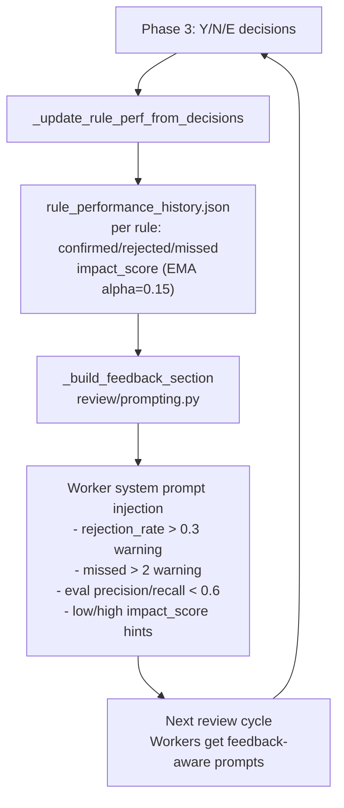

# Pecker Architecture

## System Topology

## Data Flow

## Feedback Loop

## File Mapping

| Node / Responsibility | File | Key Function |
|---|---|---|
| Orchestrator (Phase 2 SSE) | `api/routes/review.py` | `run_review()` |
| Precheck (Phase 1) | `api/routes/review.py` | `precheck()` |
| Worker execution | `review/worker.py` | `_worker_core()`, `_run_worker_async()` |
| Parallel dispatch | `review/orchestration.py` | `parallel_review()`, `_single_round_async()` |
| Merge / dedup | `review/aggregation.py` | `merge_and_deduplicate()` |
| Majority vote | `review/aggregation.py` | `majority_vote()` |
| Evidence verification | `review/evidence_verify.py` | `verify_evidence()`, `_find_wiki_page()`, `_find_rule_reference()` |
| Goshawk advisor | `goshawk_advisor.py` | `advisor_review()`, `advisor_review_async()` |
| Goshawk result merge | `goshawk_advisor.py` | `apply_advisor_result()` |
| Haiku sanity check | `goshawk_advisor.py` | `_sanity_check_false_positives()` |
| Opaque handle + signature | `api/models.py` | `ReviewResult`, `compute_signature()` |
| Phase 3 confirm | `api/routes/review.py` | `confirm_review()` |
| Rule perf feedback | `api/routes/review.py` | `_update_rule_perf_from_decisions()` |
| Eval ground truth | `api/routes/review.py` | `_save_eval_ground_truth()` |
| Dimension config | `review/dimensions.py` | `load_review_dimensions()` |
| YAML schema validation | `review/dimensions.py` | `_validate_review_dimensions_yaml()` |
| Worker prompt building | `review/prompting.py` | `_build_worker_system()`, `_build_worker_messages()`, `_build_feedback_section()` |
| Parallel review facade | `parallel_review.py` | re-exports only (1223 → 78 lines after SPLIT_PLAN) |
| Model tiers / config | `agent_config.py` -> `config/` | `MODEL_TIERS` |
| Confidence scoring | `cuckoo_parser.py` | `compute_confidence()` |
| Gate log (decision chain) | `goshawk_advisor.py` | `_build_gate_log()` |
| Prompt cache monitor | `cache_monitor.py` | `PromptCacheMonitor` |
| Event sourcing | `event_store.py` | `EventStore` |
| B-class semantic verify | `review/evidence_verify.py` | `_verify_b_class_semantic()` |

## Model Assignment

| Component | Model | Rationale |
|---|---|---|
| structure worker (织布鸟) | sonnet | Pattern matching, no deep reasoning |
| quality worker (猫头鹰) | sonnet | Logic check, moderate reasoning |
| ai_coding worker (渡鸦) | opus | Deep reasoning for pseudocode / traceability |
| data_quality worker (鸬鹚) | sonnet | Field mapping check |
| Goshawk advisor (苍鹰) | opus | Cross-validation needs strongest model |
| Haiku sanity check | haiku | Cheap binary agree/disagree |
| Precheck gap analysis | sonnet | Lightweight knowledge scan |
