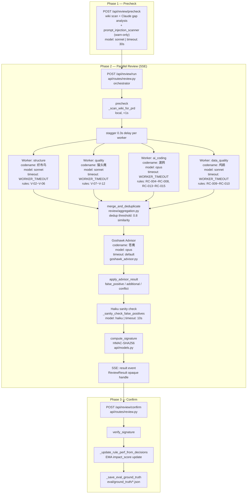
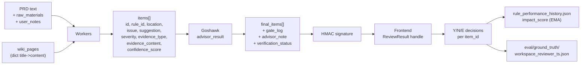
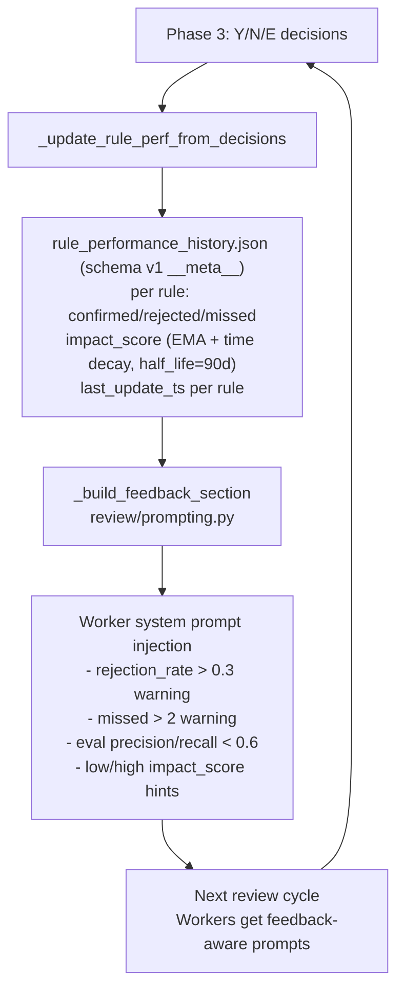

# Pecker Architecture

## System Topology

## Data Flow

## Feedback Loop

## Codename ↔ Code Identifier Mapping

**代码里用英文 `dim_key` 做 programmatic identifier,文档 / UI / 口语沟通用中文鸟名 codename。**
新人 debug 时: 日志里看到 `[织布鸟]` 时对应 grep `dim_key=="structure"`;反之亦然。

| Codename (中) | `dim_key` / 模块名 | 模型 | 核心职责 | 主要代码入口 |
|---|---|---|---|---|
| 织布鸟 | `structure` | sonnet | 结构层 — BMAD 格式 / 信息密度 / 覆盖率 / 自洽 / 可追溯 | `review/worker.py`, `review/dimensions.py` |
| 猫头鹰 | `quality` | sonnet | 质量层 — 逻辑自洽 / 边界 / 异常 / 唯一性等 | `review/worker.py`, `review/dimensions.py` |
| 渡鸦 | `ai_coding` | opus | AI Coding 友好度 — 伪代码 / 字段映射 / 可追溯链路 | `review/worker.py`, `review/dimensions.py` |
| 鸬鹚 | `data_quality` | sonnet | 数据质量 — 字段口径 / schema 一致性 | `review/worker.py`, `review/dimensions.py` |
| 苍鹰 | Goshawk (advisor) | opus | 终审交叉校验 — false positive / additional / conflict | `goshawk_advisor.py` |
| 鸮鹦 | Kakapo | — | 知识库园丁 — 断链 / 孤立页 / stale / duplicate 扫描 + 修复 | `kakapo_dream.py` |
| 伯劳 | Shrike | — | 6 道质量门禁 — 报告完整性 / 编号一致 / wiki 质量 / 安全扫描 / 格式 / 依据可靠性 | `shrike_review.py` |

命名约定:
- **代码标识符(稳定契约)**: `dim_key` 在 `_DEFAULT_REVIEW_DIMENSIONS` 是 key;worker 路由 / 日志 / JSON schema 都用这个
- **Codename (用户可见)**: mermaid 图 / ARCHITECTURE / 前端 UI 文案 / 用户 / PM 沟通用中文鸟名
- 不要反过来: 不要在 JSON / 配置 / 文件名里用中文鸟名(会破坏跨平台可移植性)

## File Mapping

| Node / Responsibility | File | Key Function |
|---|---|---|
| Orchestrator (Phase 2 SSE) | `api/routes/review.py` | `run_review()` |
| Precheck (Phase 1) | `api/routes/review.py` | `precheck()` |
| Worker execution | `review/worker.py` | `_worker_core()`, `_run_worker_async()` |
| Parallel dispatch | `review/orchestration.py` | `parallel_review()`, `_single_round_async()` |
| Merge / dedup | `review/aggregation.py` | `merge_and_deduplicate()` |
| Majority vote | `review/aggregation.py` | `majority_vote()` |
| Evidence verification | `review/evidence_verify.py` | `verify_evidence()`, `_find_wiki_page()`, `_find_rule_reference()` |
| Goshawk advisor | `goshawk_advisor.py` | `advisor_review()`, `advisor_review_async()` |
| Goshawk result merge | `goshawk_advisor.py` | `apply_advisor_result()` |
| Haiku sanity check | `goshawk_advisor.py` | `_sanity_check_false_positives()` |
| Opaque handle + signature | `api/models.py` | `ReviewResult`, `compute_signature()` |
| Phase 3 confirm | `api/routes/review.py` | `confirm_review()` |
| Rule perf feedback | `api/routes/review.py` | `_update_rule_perf_from_decisions()` |
| Eval ground truth | `api/routes/review.py` | `_save_eval_ground_truth()` |
| Dimension config | `review/dimensions.py` | `load_review_dimensions()` |
| YAML schema validation | `review/dimensions.py` | `_validate_review_dimensions_yaml()` |
| Worker prompt building | `review/prompting.py` | `_build_worker_system()`, `_build_worker_messages()`, `_build_feedback_section()` |
| Parallel review facade | `parallel_review.py` | re-exports only (1223 → 78 lines after SPLIT_PLAN) |
| Model tiers / config | `agent_config.py` -> `config/` | `MODEL_TIERS` |
| Confidence scoring | `cuckoo_parser.py` | `compute_confidence()` |
| Gate log (decision chain) | `goshawk_advisor.py` | `_build_gate_log()` |
| Prompt cache monitor | `cache_monitor.py` | `PromptCacheMonitor` |
| Event sourcing | `event_store.py` | `EventStore` |
| B-class semantic verify | `review/evidence_verify.py` | `_verify_b_class_semantic()` |
| Rule perf store (v1) | `rule_perf_store.py` | `load()`, `save()`, `iter_rules()`, `_migrate()` |
| Rule perf EMA + time decay | `rule_perf_decay.py` | `decay_to_neutral()`, `ema_with_time_decay()` |
| Rule perf hygiene 对账 | `scripts/rule_perf_hygiene.py` | zombies / cold rules 扫描 |
| Prompt injection scan | `prompt_injection_scanner.py` | `scan()`, `scan_inputs()` (warn-only) |
| Per-tool-call trace | `review/worker.py`, `goshawk_advisor.py` | `on_tool_call` callback → `tool_call_done` event |
| Stability metrics (含 retry_rate) | `scripts/stability_metrics.py` | `compute_metrics()`, `tool_breakdown` |

## Model Assignment

| Component | Model | Rationale |
|---|---|---|
| structure worker (织布鸟) | sonnet | Pattern matching, no deep reasoning |
| quality worker (猫头鹰) | sonnet | Logic check, moderate reasoning |
| ai_coding worker (渡鸦) | opus | Deep reasoning for pseudocode / traceability |
| data_quality worker (鸬鹚) | sonnet | Field mapping check |
| Goshawk advisor (苍鹰) | opus | Cross-validation needs strongest model |
| Haiku sanity check | haiku | Cheap binary agree/disagree |
| Precheck gap analysis | sonnet | Lightweight knowledge scan |

## Event Store Schema

所有事件落 `event_store.jsonl`，下游 `stability_metrics` / audit / telemetry 工具消费。新事件追加时保持向后兼容（只加字段不改语义）。

| Event type | 触发点 | 关键字段 |
|---|---|---|
| `review_started` | `run_review` 入口 | prd_name, mode, reviewer, wiki_pages_count, **injection_scan** (warn-only 扫描结果) |
| `workers_started` | 并行 dispatch 前 | mode |
| `tool_call_done` | 每次 tool 调用完成 (per-worker / per-goshawk) | dim_key, kind, model, duration_ms, tokens, cache_read, use_compact_tool |
| `worker_done` | 单 worker 结束 | dim_key, telemetry {duration_ms, tokens, cost, model} |
| `checkpoint` | 并行完成后 | workers_done, items_count |
| `review_failed` | 全员失败 abort (P0-1) | failed_count, reasons |
| `review_degraded` | 部分 worker 失败但继续 | degraded_dims, reasons |
| `final_reviewer_started` / `final_reviewer_done` | Goshawk 前后 | items_count / verdict, confidence |
| `review_completed` | Phase 2 全部完成 | final_items count, verdict |

`tool_call_done.kind` 枚举（用于 `retry_rate` 计算）：
- Worker: `initial` / `prompt_followup` / `empty_retry_followup`
- Goshawk: `goshawk_initial` / `goshawk_retry` (指数退避) / `goshawk_prompt_followup` / `goshawk_empty_retry_followup`

> `injection_scan` 是 `review_started` 事件的 payload 字段，不是独立事件 type — precheck 阶段同样扫描，结果挂在 precheck 响应 `injection_scan` 字段里（非 event）。
