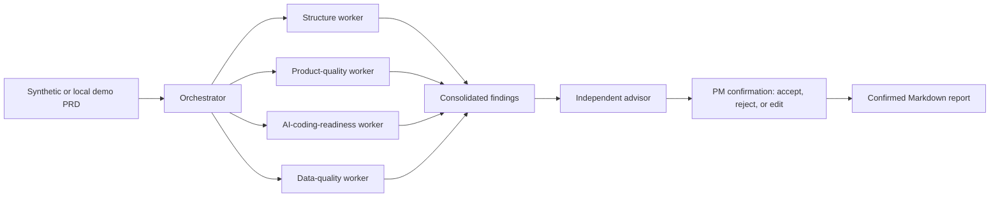
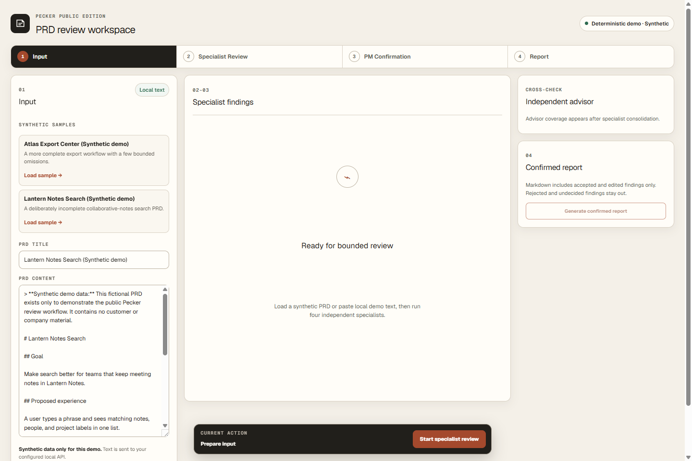
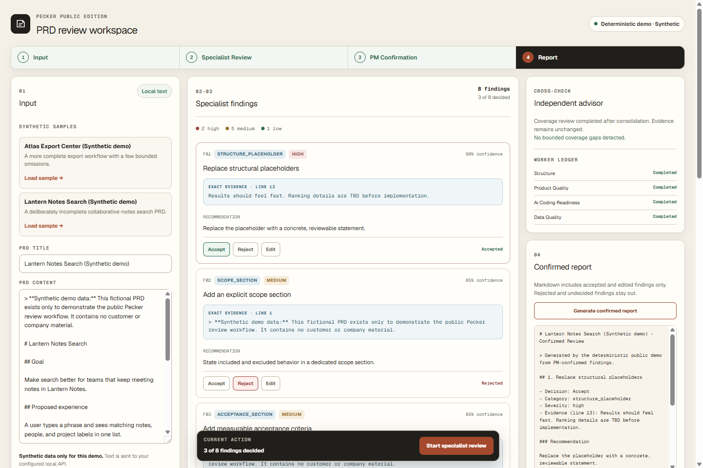

# Pecker PRD Review Agent

Pecker is a credential-free portfolio demo for reviewing product requirement documents with an inspectable multi-agent workflow. It turns ambiguous PRD text into grounded findings, lets a product manager accept, reject, or edit every recommendation, and generates a Markdown report from confirmed decisions only.

The public edition is intentionally deterministic. It demonstrates the harness, evidence discipline, failure isolation, persistence, and human confirmation loop without claiming live-LLM quality or production readiness.

## The problem it demonstrates

PRD reviews often mix several concerns into one opaque answer: document structure, product quality, implementation readiness, and data quality. That makes findings hard to audit and even harder to approve safely.

Pecker keeps those concerns separate. Four bounded specialists run independently, the orchestrator consolidates their output, an advisor checks coverage without rewriting evidence, and the PM retains the final decision on every finding.



Each worker returns `{ status, output, confidence, tokens_used }`, exposes at most three findings, and cannot call another worker. Findings cite an exact source line. A failed worker is recorded but does not cancel successful workers. The advisor can add at most two coverage notices and never alters evidence.

## Product walkthrough

Load one of the explicitly synthetic PRDs or paste non-confidential demo text. The first state keeps the input, workflow phases, and local-data boundary visible.



After review, inspect the four-worker ledger and advisor cross-check, make PM decisions, and generate the confirmed report. Counts and severity totals come from the current review.



## Public-edition boundary

This repository is designed for publication from a sanitized Git history. Its samples are fictional and begin with a synthetic-data notice. It contains no private integration or infrastructure configuration.

The boundary scanner rejects generalized personal paths, credential formats, non-documentation IP addresses, environment/database/dependency/build/test runtime paths, and project-specific terms matched only through one-way SHA-256 fingerprints. With `--history`, it checks every reachable commit message, requires GitHub noreply author and committer email addresses, and scans every historical path and blob so deletion does not hide a violation. Binary files are denied by default; only the two documented PNG screenshots are allowlisted, and their signatures, structure, and absence of text or EXIF metadata chunks are verified.

## API

The FastAPI service returns `mode: "deterministic-demo"` and stores local review state in SQLite.

| Method | Endpoint | Purpose |
| --- | --- | --- |
| `GET` | `/api/health` | Return service status and deterministic demo mode. |
| `GET` | `/api/samples` | List the two synthetic PRDs with their text and metadata. |
| `POST` | `/api/reviews` | Run the four specialists and return a completed review snapshot from `{ title, content }`. |
| `GET` | `/api/reviews/{review_id}` | Read a persisted review snapshot. |
| `POST` | `/api/reviews/{review_id}/decisions` | Apply a complete or partial list of accept, reject, or edit decisions. |
| `GET` | `/api/reviews/{review_id}/report` | Generate Markdown from accepted and edited findings only. |

Unknown review IDs return `404`. Invalid edits return `422`. The browser uses only `NEXT_PUBLIC_API_BASE_URL`, which defaults to `http://127.0.0.1:8000`.

## Run locally

Requirements: Python 3.11 or newer and a current Node.js LTS release.

Install the backend from the repository root:

```bash
python -m pip install -r requirements.lock
python -m pip install --no-build-isolation --no-deps -e .
python -m uvicorn backend.pecker.main:app --host 127.0.0.1 --port 8000
```

In another terminal, install and start the web workspace:

```bash
cd web
npm ci
npm run dev
```

Open `http://127.0.0.1:3000`. To use another backend address, set `NEXT_PUBLIC_API_BASE_URL` before starting Next.js. Runtime data defaults to `.data/pecker-demo.db`; set `PECKER_DB_PATH` to choose another local SQLite file.

## Verify locally

Run the same gates used by CI:

```bash
python -m pip install -r requirements.lock
python -m pip install --no-build-isolation --no-deps -e .
python -m pip install pip-audit==2.10.1
python -m pip_audit -r requirements.lock
python scripts/check_public_boundary.py --history
python -m pytest -q

npm --prefix web ci
npm --prefix web audit --audit-level=high
npm --prefix web run lint
npm --prefix web test
npm --prefix web run build
```

The backend suite covers worker bounds and evidence grounding, failure isolation, advisor bounds, persistence, decisions, report filtering, every endpoint, and safe/unsafe public-boundary fixtures. The frontend suite covers phase transitions, decisions, API failure recovery, report rendering, operation isolation, and keyboard-accessible editing.

## Technology

- Backend: Python 3.11, FastAPI, Pydantic, SQLite, pytest.
- Frontend: Next.js 16, React 19, TypeScript, Tailwind CSS 4, Vitest.
- CI: separate Python and Node.js jobs with locked installations, security audits, lint, tests, build, and full-history boundary scanning.

## Deliberate limitations

- Reviews use deterministic rules, not a live LLM; output demonstrates workflow behavior, not model quality.
- SQLite is local demo persistence and is not configured for multi-user or distributed workloads.
- There is no authentication, authorization, tenant isolation, encryption workflow, or production audit trail.
- Do not submit confidential, regulated, personal, or proprietary documents.
- The public demo is not production-safe and does not implement the private system's integrations or operational controls.
- Advisor notices are bounded coverage checks, not autonomous learning or a substitute for PM judgment.
